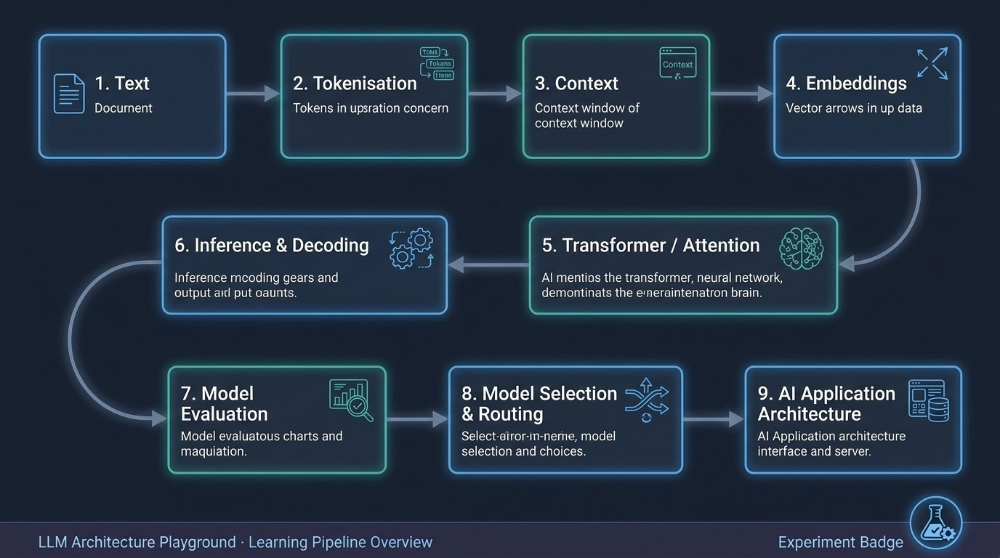
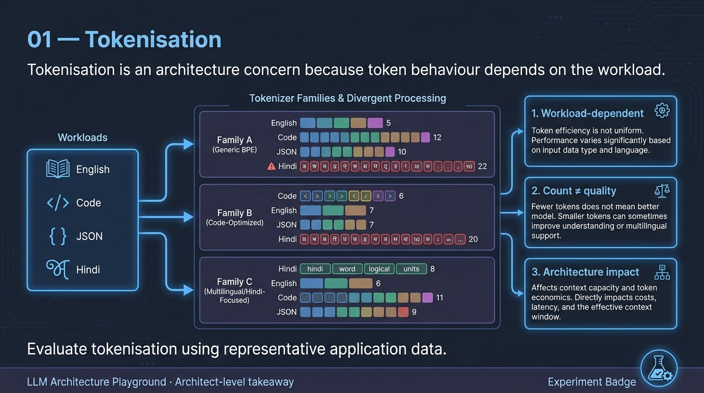
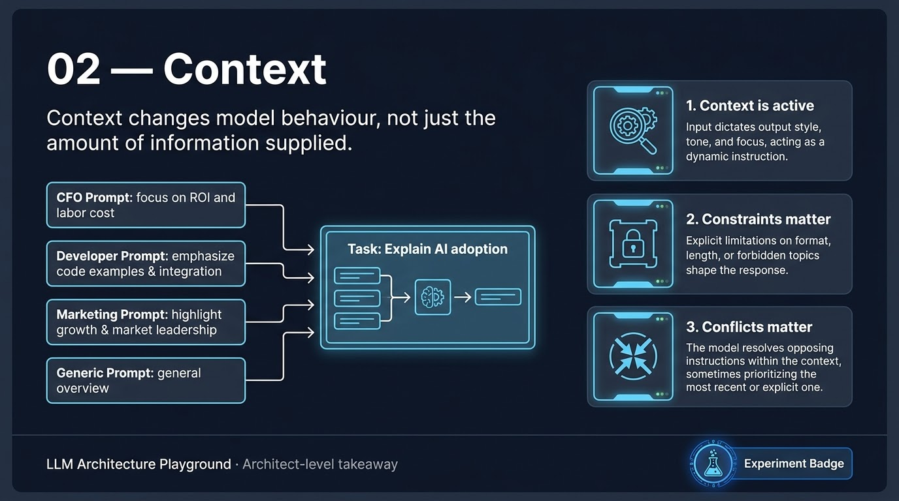
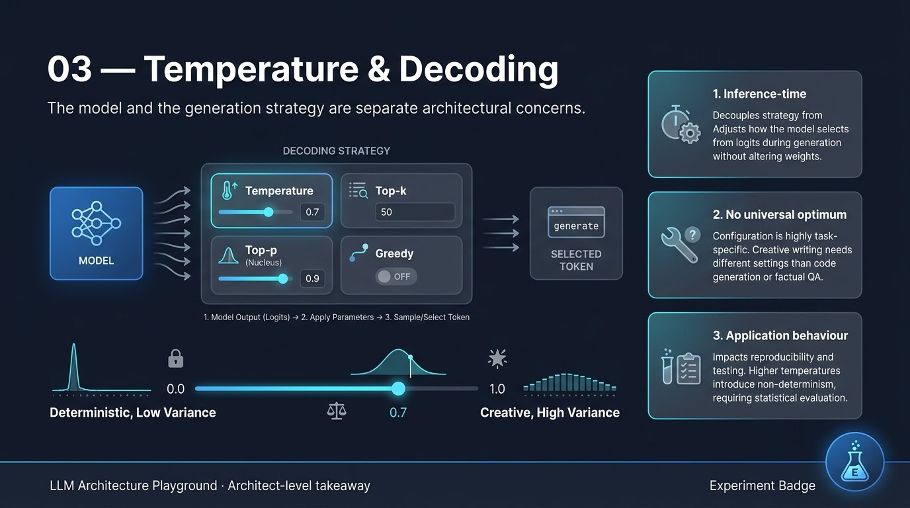
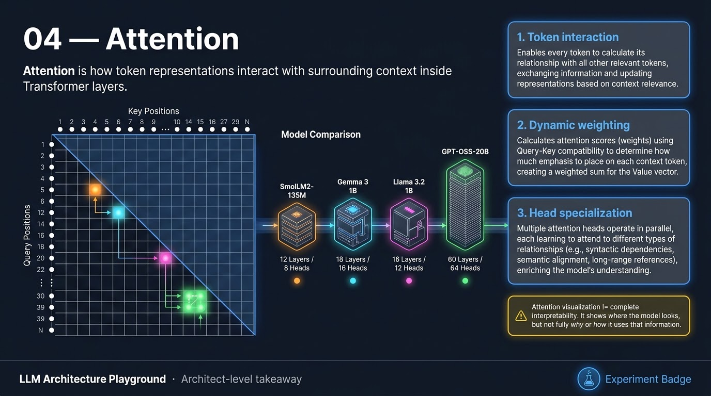
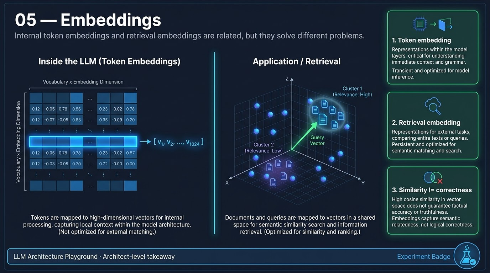
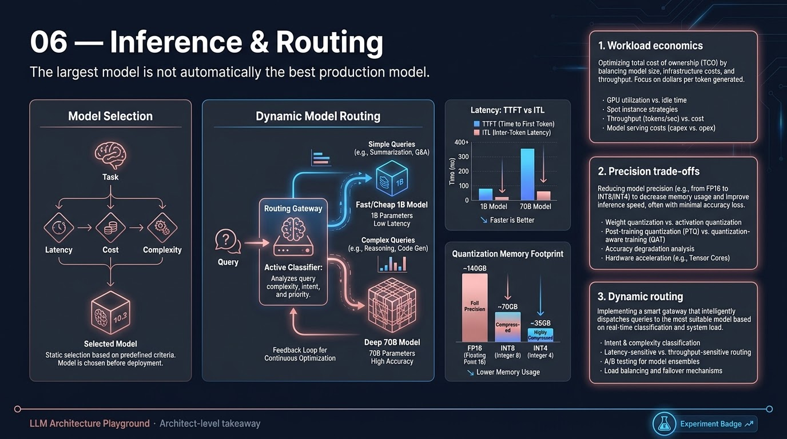

# LLM Architecture Playground

> A hands-on exploration of the LLM foundations an AI Application / Solution Architect needs to understand to make sound architecture decisions.

This repository is not about building an LLM from scratch. It is about building the **mental models needed to reason about LLM-powered applications** — from how text becomes tokens and vectors, through Transformer behaviour and generation, to inference, model evaluation and model selection.

The experiments are deliberately small and controlled: change a variable, observe the behaviour, and translate the result into an architecture-level lesson.

## The learning path



The repository stops at the **LLM foundations boundary**. RAG, agents, MCP, production AI architecture, security and governance are intentionally explored in separate repositories.

---

# What I learned

The six areas below are the core of the repository. Each infographic is designed to capture the **architecture-relevant lessons**, while the linked experiment README contains the detailed evidence, methodology, results and limitations.

## 01 — Tokenisation



**Core idea:** Tokenisation is not just a preprocessing detail. Token behaviour varies with the workload and directly affects context utilisation and token-based economics.

**Key architecture lessons**
- Token count is workload-dependent.
- Code, JSON, URLs, numbers and multilingual text can behave very differently from ordinary English.
- Token count alone does not indicate model quality.
- Token segmentation matters as well as token count.
- Representative application data should be used when evaluating models and context capacity.

→ **[Read the Tokenisation experiment](experiments/01-tokenisation/README.md)**

---

## 02 — Context



**Core idea:** The LLM does not receive "just the question". The surrounding context is an active part of application behaviour.

**Key architecture lessons**
- Audience changes framing, emphasis and vocabulary.
- Constraints can change both content and output structure.
- System instructions, user requests, examples, history and retrieved information all contribute to behaviour.
- Conflicting instructions can produce unpredictable or imperfect results.
- Context engineering becomes a core concern in AI application architecture.

→ **[Read the Context experiment](experiments/02-context/README.md)**

---

## 03 — Temperature & Decoding



**Core idea:** Generation configuration is part of application design. The model and the way it generates are separate concerns.

**Key architecture lessons**
- Temperature is an inference-time parameter; it does not modify model weights.
- Lower temperature can favour repeatability and consistency.
- Higher temperature can introduce greater variation.
- There is no universally "best" temperature.
- Decoding strategy should reflect the application's requirements for determinism, creativity, correctness and testing.

→ **[Read the Temperature experiment](experiments/03-temperature/README.md)**

---

## 04 — Attention



**Core idea:** Attention is the mechanism through which token representations interact with surrounding context inside Transformer layers.

**Key architecture lessons**
- Attention operates over query/key positions and produces structured attention matrices.
- Different model families have different numbers of layers and attention heads.
- Sequence length directly affects attention structure.
- Different heads and layers can exhibit different patterns.
- Causal attention is fundamental to autoregressive decoder-style generation.
- Attention visualisation is useful for understanding architecture, but should not automatically be treated as a complete interpretability method.

→ **[Read the Attention experiment](experiments/04-attention/README.md)**

---

## 05 — Embeddings



**Core idea:** There are two related but distinct embedding concepts an AI architect needs to keep separate: **internal token embeddings** and **application-level retrieval embeddings**.

**Key architecture lessons**
- Token IDs are identifiers, not semantic values.
- The model maps token IDs to learned vectors through an embedding layer.
- Internal token embeddings are part of the Transformer processing pipeline.
- Retrieval embeddings turn text into vectors that can be compared for similarity and retrieval.
- Similarity enables retrieval but does not guarantee semantic correctness.
- Larger embedding dimensions do not automatically mean better retrieval.

→ **[Read the Embeddings experiment](experiments/05-embeddings/README.md)**

---

## 06 — Inference, Model Selection & Routing



**Core idea:** The largest or most popular model is not automatically the best production model.

**Key architecture lessons**
- Inference involves prompt processing and autoregressive decoding, not simply "send prompt, get answer".
- Output length, workload and model characteristics affect latency and throughput.
- Decoding configuration can change application behaviour without changing the model.
- Model selection is a multi-dimensional decision:

```text
Quality
  + Latency
  + Throughput
  + Cost
  + Context requirements
  + Workload characteristics
  + Runtime / hardware constraints
```

- Quantisation can change deployment feasibility and resource requirements, but variants must be benchmarked.
- Model selection asks **which model should the application use?**
- Model routing asks **which model should handle this request?**
- Routing can optimise cost and latency, but introduces additional architecture and operational complexity.

→ **[Read the Inference & Model Selection experiments](experiments/06-inference-and-model-selection/README.md)**

---

# The architecture mental model

The experiments build one connected mental model:

```text
                         AI APPLICATION
                              │
              Context / instructions / history
                    / retrieved information
                              │
                              ▼
                         Tokeniser
                              │
                              ▼
                          Token IDs
                              │
                              ▼
                      Embedding Layer
                              │
                              ▼
                       Token Vectors
                              │
                              ▼
                   Transformer Layers
                    ┌─────────┴─────────┐
                    │ Attention + MLP   │
                    └─────────┬─────────┘
                              │
                              ▼
                            Logits
                              │
                              ▼
                       Decoding / Sampling
                              │
                              ▼
                       Generated Output

        ┌──────────┬──────────┬──────────┬──────────┐
        │  Quality │  Latency │   Cost   │  Context │
        └──────────┴──────────┴──────────┴──────────┘
                              │
                       Model / Runtime
                         Architecture
```

The shift I am deliberately making through this repository is:

> **From understanding how an LLM works → to understanding how an LLM behaves as an application component.**

That means being able to reason about:

- context and prompt capacity
- model behaviour and decoding
- quality and evaluation
- latency and throughput
- token economics
- model choice
- quantisation and runtime constraints
- model routing

---

# Repository structure

```text
llm-architecture-playground/
│
├── experiments/
│   ├── 01-tokenisation/
│   ├── 02-context/
│   ├── 03-temperature/
│   ├── 04-attention/
│   │   └── 04b-attention-analysis/
│   ├── 05-embeddings/
│   │   └── 05a-retrieval-embeddings/
│   └── 06-inference-and-model-selection/
│       ├── 01-inference-basics/
│       ├── 02-decoding/
│       ├── 03-model-selection/
│       ├── 04-cost-latency-quality/
│       ├── 05-quantisation/
│       └── 06-model-routing/
│
├── docs/
│   └── infographics/
│
├── requirements.txt
└── README.md
```

Each experiment has its own README containing the detailed question, methodology, results, learnings and architect-level takeaway. The root README intentionally stays at the **navigation and mental-model level**.

---

# What this repository deliberately does not cover

This repository is intentionally limited to LLM foundations.

It does not cover:

- RAG architecture
- vector databases and hybrid search
- chunking and retrieval evaluation
- reranking
- agents and agent planning
- tool use
- MCP
- multi-agent systems
- production AI gateways
- AI security and governance
- enterprise AI platform architecture

Those topics belong in separate, topic-focused repositories.

It also avoids deep ML-engineering topics such as training an LLM from scratch, distributed training, GPU kernel optimisation and advanced embedding-model training.

The target depth is:

> **Enough technical understanding to make and defend AI application architecture decisions.**

---

# Wider learning journey

This repository represents the **LLM Foundations** stage:

```text
┌──────────────────────────────┐
│ LLM FOUNDATIONS              │
│                              │
│ This repository              │
│ Tokenisation                 │
│ Context                      │
│ Temperature / Decoding       │
│ Attention                    │
│ Embeddings                   │
│ Inference                    │
│ Model Selection              │
└──────────────┬───────────────┘
               │
               ▼
┌──────────────────────────────┐
│ RAG / KNOWLEDGE ARCHITECTURE │
│ Separate repository          │
└──────────────┬───────────────┘
               │
               ▼
┌──────────────────────────────┐
│ AGENTIC AI                   │
│ Separate repository          │
└──────────────┬───────────────┘
               │
               ▼
┌──────────────────────────────┐
│ MCP / INTEGRATION            │
│ Separate repository          │
└──────────────┬───────────────┘
               │
               ▼
┌──────────────────────────────┐
│ PRODUCTION AI ARCHITECTURE   │
│ Separate repository          │
└──────────────────────────────┘
```

## Final takeaway

The goal of this repository was never to implement an LLM.

It was to build enough understanding to **reason about one**.

```text
INSIDE THE MODEL

Tokens
  → Embeddings
  → Transformer
  → Attention
  → Logits
  → Decoding


AROUND THE MODEL

Context
  → Model choice
  → Inference
  → Quality
  → Latency
  → Cost
  → Runtime
  → Routing
```

That combination is the foundation for moving from **understanding LLMs** to **architecting applications that use LLMs**.

**Status: LLM Foundations — Complete**
